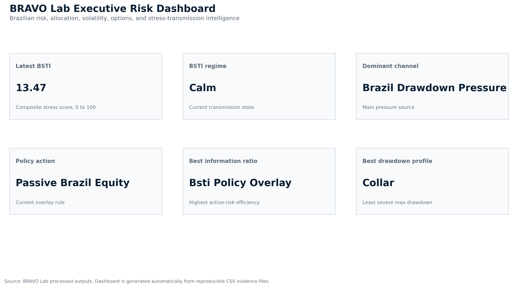

# BRAVO Lab

**Brazilian Risk, Allocation, Volatility & Options Lab**

[](https://github.com/rolffcoelho-bravo/bravo-lab/actions/workflows/ci.yml)


## Start Here

BRAVO Lab includes a front-office report package for fast review.

| Entry point | Purpose |
| --- | --- |
| [`reports/front_office_memo.md`](reports/front_office_memo.md) | Short portfolio-governance memo for PMs, risk committees, allocators, and reviewers |
| [`reports/baseline_report.md`](reports/baseline_report.md) | Full quant/risk report with methodology, diagnostics, evidence files, and limitations |
| [`reports/README.md`](reports/README.md) | Report navigation guide |
| [`reports/figures/00_executive_risk_dashboard.png`](reports/figures/00_executive_risk_dashboard.png) | Premium executive risk dashboard |

The fastest way to review the project is:

1. Read the front-office memo.
2. Open the executive risk dashboard.
3. Inspect the full baseline report.
4. Verify the generated CSV outputs in `data/processed/`.

## Visual Proof



The dashboard above is generated automatically from the reproducible BRAVO Lab pipeline. It summarizes the latest Brazil stress state, dominant pressure channel, portfolio policy action, and active-risk leaders.


BRAVO Lab is a Python research pipeline for transforming Brazilian market volatility, derivatives overlays, contagion signals, and dynamic risk regimes into portfolio-grade analytical reports.

The project asks a practical question: can advanced financial-econometric models improve how Brazilian equity exposure is protected, monetized, and evaluated across calm, fragile, stress, and extreme-stress market regimes?

This repository is not a trading recommendation. It is a research infrastructure prototype built to show how Brazilian market knowledge, derivatives logic, financial econometrics, and automation can be transformed into a repeatable portfolio research pipeline.

## Why this project matters

Brazilian assets often move through regimes shaped by local interest rates, FX pressure, global risk appetite, commodity shocks, political stress, liquidity conditions, and external contagion channels.

A derivatives overlay that works in calm markets may behave very differently during stress. BRAVO Lab is built around one practical question:

**Can volatility and contagion signals improve the timing and structure of derivatives overlays in Brazilian equity exposure?**

The long-term goal is to generate a decision-grade report that can support real portfolio discussion, including:

* data quality summary
* market regime summary
* volatility analysis
* GARCH / MTV-GARCH risk layer
* Brazil Stress Transmission Index
* covered call and collar strategy evaluation
* passive benchmark comparison
* transaction-cost impact
* tracking error
* drawdown and stress-window analysis
* limitations and implementation caveats
* final decision matrix

## Strategy universe

The planned research pipeline compares four strategy families:

1. **Passive Brazilian equity exposure**
   Benchmark exposure using BOVA11 / IBOV-style proxies.

2. **Systematic covered call overlay**
   Equity exposure with recurring call overwrite logic.

3. **Protective collar overlay**
   Equity exposure combined with sold calls and purchased downside protection.

4. **Stress-aware dynamic overlay**
   Strategy behavior changes according to volatility, drawdown, contagion, and stress-regime signals.

## Model architecture

The project follows a layered methodology:

1. Baseline realized-volatility features
2. Rolling drawdown and downside-risk indicators
3. GARCH volatility layer
4. Multivariate Time-Varying GARCH or DCC-style dynamic covariance fallback
5. Brazil Stress Transmission Index
6. Future CCA / Ridge CCA stress-compression layer
7. Future wavelet stress decomposition
8. Future ML regime-classification robustness layer
9. Future high-dimensional network contagion extension

## Repository structure

```text
bravo-lab/
|-- app/
|-- data/
|   |-- raw/
|   `-- processed/
|-- docs/
|   |-- methodology.md
|   `-- reviewer_guide.md
|-- notebooks/
|-- reports/
|   |-- figures/
|   `-- financial_sector_application_note.md
|-- src/
|   `-- bravo/
|-- Makefile
|-- README.md
|-- CITATION.cff
`-- requirements.txt
```

## Quality Gate

BRAVO Lab includes an offline smoke-test and CI layer to protect the integrity of the research package.

| Check | Purpose |
| --- | --- |
| `tests/test_imports.py` | Confirms core BRAVO Lab modules import correctly |
| `tests/test_report_artifacts.py` | Confirms report files, premium figures, and processed evidence files exist |
| GitHub Actions CI | Runs the offline smoke tests automatically on push and pull request |
| `reports/front_office_memo.md` | Confirms the front-office decision layer is generated and inspectable |
| `reports/figures/` | Confirms visual evidence is available for fast review |

Run locally: `PYTHONPATH=src pytest -q`

## Quickstart

BRAVO Lab includes a reproducible report package, processed evidence files, premium figures, offline tests, and CI.

### Windows PowerShell

```powershell
python -m pip install -r requirements.txt
$env:PYTHONPATH="src"
python -m pytest -q
python scripts/generate_report.py
```

### macOS / Linux

```bash
python -m pip install -r requirements.txt
PYTHONPATH=src pytest -q
PYTHONPATH=src python scripts/generate_report.py
```

Optional: if GNU Make is installed, `make report` may also be used. On Windows PowerShell, the direct Python script is the safer default.

The generated report outputs are available in `reports/`, with reproducible CSV evidence in `data/processed/`.


## Current implementation status

| Component | Status |
| --- | --- |
| Repository structure | Implemented |
| Reviewer documentation | Implemented |
| Data pipeline | Implemented |
| Baseline market-risk metrics | Implemented |
| Volatility and drawdown regime engine | Implemented |
| Synthetic covered call and collar overlays | Implemented |
| Active-risk diagnostics | Implemented |
| Brazil Stress Transmission Index | Implemented |
| BSTI threshold validation | Implemented |
| BSTI calibration layer | Implemented |
| BSTI overlay policy selection | Implemented |
| BSTI persistence and transition diagnostics | Implemented |
| Premium visual evidence layer | Implemented |
| Front-office executive memo | Implemented |
| Standalone report index | Implemented |
| Offline tests and GitHub Actions CI | Implemented |
| Windows-friendly report runner | Implemented |
| Real B3 option-chain validation | Future upgrade |
| MTV-GARCH / dynamic covariance layer | Future upgrade |
| CCA / Ridge CCA stress-compression layer | Future upgrade |
| Wavelet stress decomposition | Future upgrade |
| ML regime-classification robustness layer | Future upgrade |


## Roadmap

### Phase 1: Reviewer-facing documentation

Create a clear professional layer explaining the investment problem, methodology, assumptions, and reviewer workflow.

### Phase 2: Data and baseline metrics

Build reproducible data ingestion, return construction, realized volatility, drawdown metrics, and benchmark analysis.

### Phase 3: Options overlay backtests

Implement synthetic covered call and collar logic with transaction costs, tracking error, and stress-window analysis.

### Phase 4: Advanced risk engine

Add GARCH, MTV-GARCH or DCC-style fallback logic, and the Brazil Stress Transmission Index.

### Phase 5: Decision-grade reporting

Generate an automated report suitable for investment, portfolio solutions, or risk-committee review.

## Reviewer note

This repository is intentionally transparent about what is implemented and what is planned. It is designed to demonstrate research architecture, market understanding, reproducibility discipline, and the ability to convert advanced financial-econometric ideas into usable portfolio research infrastructure.

## Disclaimer

This project is for research, education, and portfolio infrastructure demonstration only. It does not provide investment advice, trading recommendations, or performance guarantees.

## Citation

BRAVO Lab is released under the MIT License. You are free to use, modify, and build on the code under the terms of that license.

If you use this project, its code, methodology, diagnostics, research structure, or analytical framework in academic work, professional research, reports, presentations, or derivative projects, please cite:

> Pereira, Rodolfo. (2026). *BRAVO Lab: Brazilian Risk, Allocation, Volatility & Options Lab*. ShockBridge Pulse Research. Python research software. https://github.com/rolffcoelho-bravo/bravo-lab

### BibTeX

    @software{pereira2026bravolab,
      author = {Pereira, Rodolfo},
      title = {BRAVO Lab: Brazilian Risk, Allocation, Volatility & Options Lab},
      year = {2026},
      publisher = {ShockBridge Pulse Research},
      type = {Python research software},
      url = {https://github.com/rolffcoelho-bravo/bravo-lab}
    }

