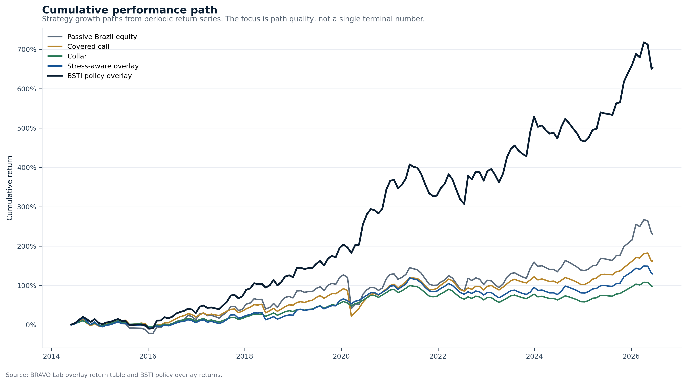
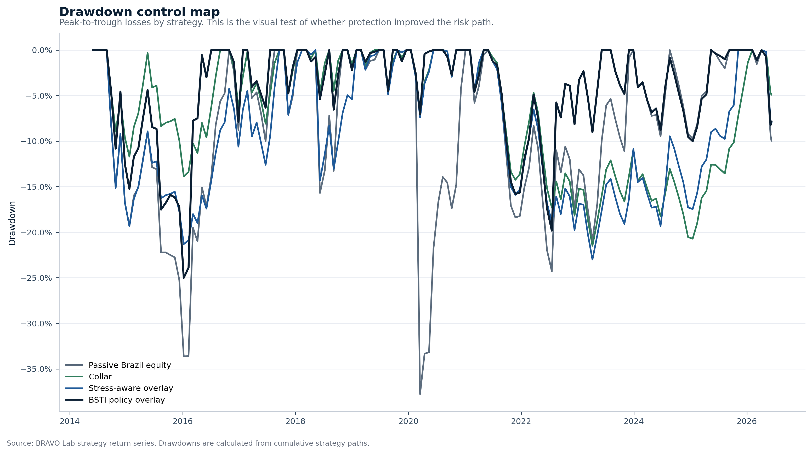
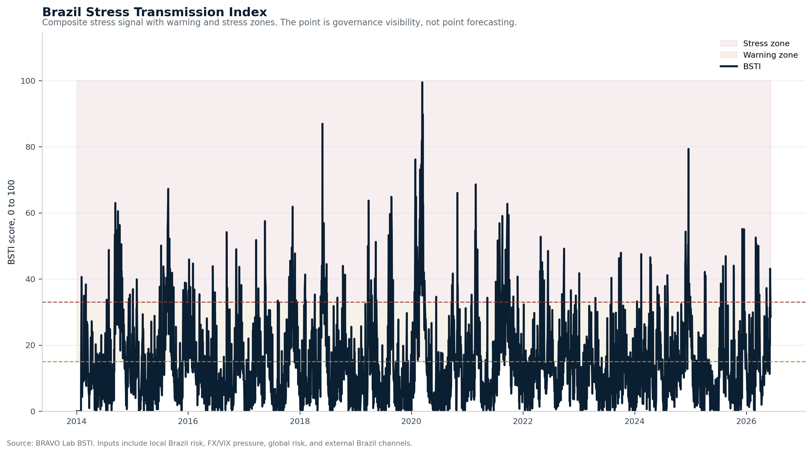
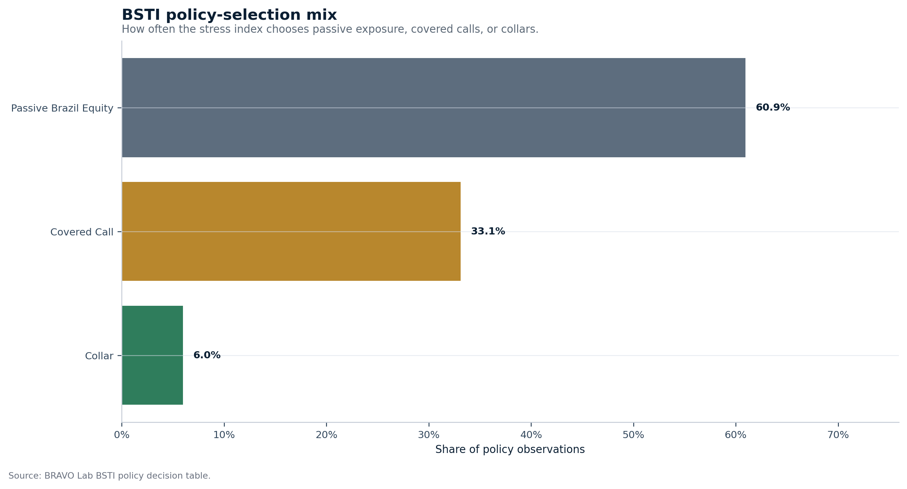
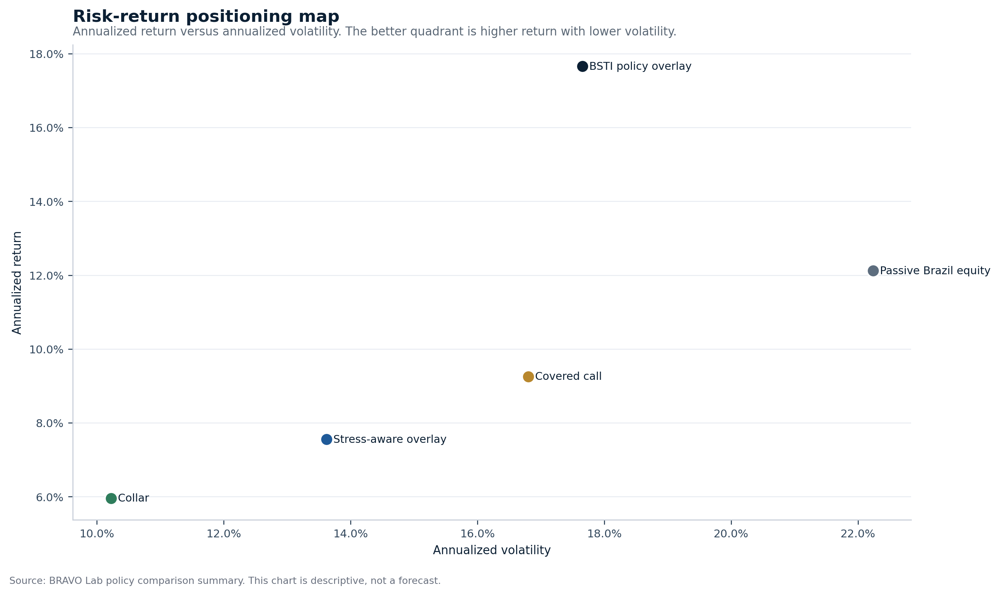
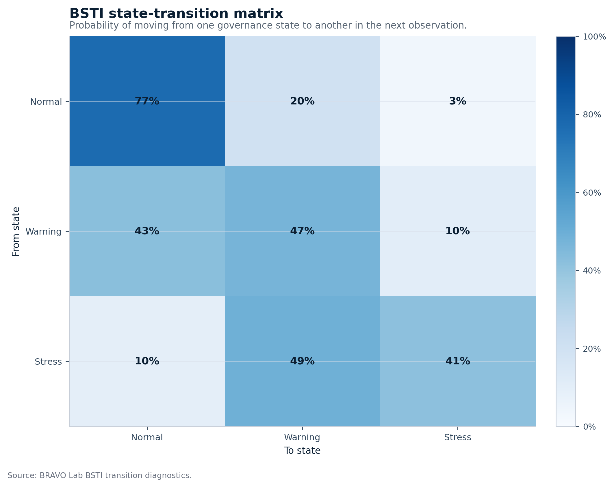
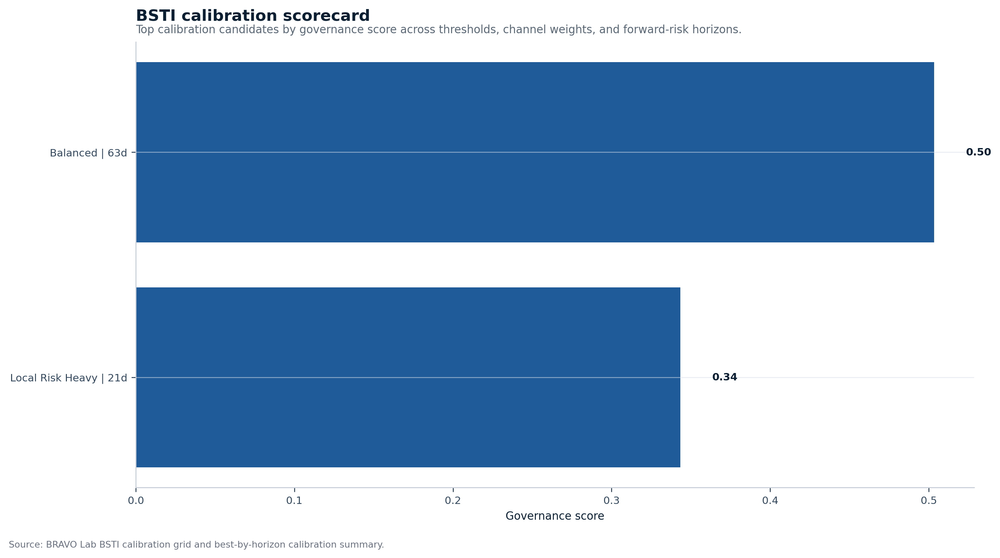

# BRAVO Lab Market Regime and Overlay Decision Report

**Subtitle:** Brazilian Equity Risk, Volatility Transmission, and Synthetic Protection Logic

Generated at: **2026-06-09 17:28:09 UTC**

Data window: **2014-01-02 to 2026-06-09**

Target report length: **36 to 40 PDF pages**

## Front-Office Executive Memo

### Decision read

BRAVO Lab currently reads Brazilian risk through a BSTI score of **28.65**, classified as **Fragile**, with **Vix Pressure** as the dominant pressure channel. The current BSTI policy action is **Covered Call**.

The model is prioritizing income capture. The committee should check whether the upside sold is acceptable under the current stress state.

### Portfolio action snapshot

| Item | Current read |
| --- | --- |
| Current BSTI score | 28.65 |
| Current BSTI regime | Fragile |
| Dominant pressure channel | Vix Pressure |
| Current policy action | Covered Call |
| Dominant historical policy choice | Passive Brazil Equity (60.93%) |
| BSTI policy annualized active return | 5.54% |
| BSTI policy tracking error | 10.18% |
| BSTI policy information ratio | 0.54 |
| BSTI policy max drawdown | -25.01% |

### Evidence stack

| Question | Evidence read |
| --- | --- |
| Which strategy had the best information ratio? | Bsti Policy Overlay |
| Which strategy had the best drawdown profile? | Collar |
| Which strategy had the highest annualized return? | Bsti Policy Overlay |
| How persistent are warning states? | Average warning duration: 1.89 observations |
| How persistent are stress states? | Average stress duration: 1.71 observations |
| How often do warnings escalate? | Warning-to-stress escalation rate: 24.14% |
| Which BSTI calibration is strongest? | Balanced, 63d horizon, threshold 10.00, governance score 0.50 |

### Risk committee agenda

1. Confirm whether the current BSTI state is persistent or only a temporary pressure print.
2. Check whether the implied policy action matches the committee's drawdown tolerance.
3. Compare the BSTI policy overlay against passive equity, covered calls, collars, and the local stress-aware overlay.
4. Review whether the selected action is justified after transaction costs, liquidity, taxes, and implementation constraints.
5. Decide whether the stress state requires monitoring, hedge discussion, or actual overlay activation.

### Implementation warning

This memo is a decision-support layer, not an investment recommendation. The evidence is generated from public market data, synthetic option-premium logic, transparent stress classification, and reproducible CSV outputs. Real B3 option-chain data, liquidity filters, tax effects, and portfolio mandate constraints must be added before production use.

## Premium Visual Evidence Layer

### Executive risk dashboard

**Interpretation:** One-page visual summary of the current stress state, dominant channel, policy action, and active-risk leaders.

### Cumulative performance path

**Interpretation:** Shows whether the overlay logic improves the investment path through time, not only the final number.

### Drawdown control map

**Interpretation:** Tests whether the strategy actually reduces the left-tail pain investors care about.

### Brazil Stress Transmission Index

**Interpretation:** Displays warning and stress zones so the stress signal becomes interpretable as a governance state.

### BSTI policy-selection mix

**Interpretation:** Shows how the model distributes portfolio actions across passive exposure, covered calls, and collars.

### Risk-return positioning map

**Interpretation:** Places each strategy in annualized return versus annualized volatility space.

### BSTI state-transition matrix

**Interpretation:** Shows whether the stress signal behaves like a persistent warning process or a random flash.

### BSTI calibration scorecard

**Interpretation:** Ranks calibration candidates across thresholds, channel weights, and forward-risk horizons.

## 1. Executive Signal

**Current regime:** `stress`

**Latest realized volatility:** 16.32%

**Latest drawdown:** -14.85%

**Decision bias:** Protection bias. The current signal gives more weight to drawdown control than to full upside capture. The strongest drawdown profile is currently `collar`. The strongest risk-adjusted profile is currently `collar`.

**Best information ratio versus passive:** `covered_call`

ShockBridge Signal: the market is inside a stress transmission zone. Covered calls may monetize volatility, but collars carry stronger portfolio logic while drawdown pressure remains active.

## 2. Report Map

| PDF Page Target | Section | Decision Purpose |
| ---: | --- | --- |
| 1 | Executive Signal | Current regime, decision bias, and portfolio read |
| 2 | Portfolio Question | What the framework is trying to decide |
| 3 | Market State | Cross-market context for Brazil exposure |
| 4 | Data Provenance | Separates real data, derived metrics, synthetic assumptions, and model rules |
| 5 | Regime Diagnosis | Volatility, drawdown, and current regime |
| 6 | Baseline Risk Metrics | Return, risk, Sharpe, drawdown, VaR, CVaR |
| 7 | Synthetic Overlay Results | Passive versus covered call versus collar versus stress-aware overlay |
| 8 | Active Risk Diagnostics | Tracks active return, tracking error, hit rate, and information ratio |
| 9 | Active Risk by Regime | Shows where each overlay creates tracking error by market state |
| 10 | Multi-Asset Stress Signals | Adds FX, VIX, EWZ, and global-equity pressure to the stress view |
| 11 | Brazil Stress Transmission Index | Converts stress signals into a formal 0 to 100 composite index |
| 12 | BSTI Threshold Validation | Tests whether BSTI thresholds connect to future drawdowns and overlay behavior |
| 13 | BSTI Threshold Calibration | Tests alternative thresholds and component-weighting schemes |
| 14 | BSTI Overlay Policy Selection | Converts calibrated stress signals into portfolio actions |
| 15 | BSTI Signal Persistence | Tests warning-state durability, escalation, and pressure-channel transitions |
| 16 | Drawdown and Recovery Diagnostics | Tests behavior in drawdown depth and rebound windows |
| 17 | Regime and Stress Diagnostics | Tests whether the overlay helps when market pressure rises |
| 12 | Strategy Help-Hurt Diagnostics | Explains when each overlay adds value or creates drag |
| 13 | Implementation Drag Diagnostics | Separates gross signal, cost drag, and net overlay effect |
| 14 | Option Overlay Attribution | Separates premium, protection cost, payoff, drag, and net effect |
| 15 | Option Attribution by Context | Explains option components by regime and drawdown bucket |
| 16 | Overlay Decision Matrix | When each strategy is useful or dangerous |
| 17 to 18 | Results SWOT | How to cope with the signal before portfolio action |
| 13 | ShockBridge Transmission Read | How stress moves into the book |
| 14 | What To Watch Next | Confirmation signals and warning signals |
| 15 | Model Limits and Evidence Files | What is proven, what is not, and what comes next |

## 3. Portfolio Question

The core question is not whether passive equity, covered calls, collars, or
stress-aware switching are better in isolation. The correct question is
regime-dependent.

When Brazilian equity risk changes state, should the portfolio keep full beta,
sell volatility through covered calls, pay for downside protection through
collars, or switch exposure based on regime evidence?

This report gives the first reproducible answer. It measures the market state,
classifies the volatility and drawdown regime, compares synthetic overlays,
calculates active risk versus passive Brazilian equity, and turns the result
into a portfolio decision frame.

## 4. Market State

The baseline market layer tracks Brazilian equity exposure, external Brazil
exposure, global equity risk, USD/BRL, and VIX. This gives a first cross-market
view of local beta, external Brazil risk, global risk appetite, currency stress,
and volatility pressure.

This is not yet a full production model. It is a clean research base. The value
is transparency. A reviewer can inspect the assumptions, rerun the output, and
challenge the decision logic.

## 5. Data Provenance and Evidence Classification

A robust report must separate observed data from modeled signals.

The market layer uses real public market data downloaded through Yahoo Finance
with `yfinance`. The derivatives layer is synthetic. Covered call and collar
premiums are estimated through the Black-Scholes engine until real B3
listed-option chains are integrated.

This distinction matters. A real price series can support risk measurement. A
synthetic option premium can support research design. It cannot yet support live
execution decisions.

| Layer | Item | Source | Evidence Type | Status |
| --- | --- | --- | --- | --- |
| market_data | brazil_equity | Yahoo Finance through yfinance | real_public_market_price_series | real market proxy |
| market_data | brazil_external | Yahoo Finance through yfinance | real_public_market_price_series | real market proxy |
| market_data | global_equity | Yahoo Finance through yfinance | real_public_market_price_series | real market proxy |
| market_data | fx_usdbrl | Yahoo Finance through yfinance | real_public_market_price_series | real market proxy |
| market_data | vix | Yahoo Finance through yfinance | real_public_market_price_series | real market proxy |
| derived_metric | realized_volatility | BRAVO Lab calculation | model_derived | derived from real market data |
| derived_metric | drawdown | BRAVO Lab calculation | model_derived | derived from real market data |
| regime_signal | baseline_regime_classifier | BRAVO Lab rule-based classifier | model_generated_signal | decision signal, not observed market data |
| synthetic_derivatives | covered_call_overlay | BRAVO Lab synthetic option engine | synthetic_research_assumption | not real B3 option-chain evidence |
| synthetic_derivatives | collar_overlay | BRAVO Lab synthetic option engine | synthetic_research_assumption | not real B3 option-chain evidence |
| strategy_logic | stress_aware_overlay | BRAVO Lab switching rule | model_generated_strategy_rule | research rule requiring validation |

## 6. Regime Diagnosis

The current Brazilian equity signal sits in `stress`.

That matters because the same overlay can behave well in one regime and poorly
in another. A covered call can create useful income in a range-bound market, but
it can also sell the recovery too cheaply. A collar can protect the book during
stress, but it can also become expensive insurance if drawdown risk fades.

The regime classifier uses realized volatility, volatility percentile, and
drawdown. It is simple by design. The point is to create an auditable baseline
before adding GARCH, MTV-GARCH, stress transmission indexes, wavelets, CCA, or
machine learning.

### Regime Snapshot

Latest classified regime: **stress**

Latest realized volatility: **16.32%**

Latest drawdown: **-14.85%**

### Regime Distribution

| Regime | Observations | Share |
| --- | ---: | ---: |
| stress | 921 | 31.03% |
| extreme_stress | 737 | 24.83% |
| calm | 674 | 22.71% |
| fragile | 334 | 11.25% |
| neutral | 302 | 10.18% |

## 7. Baseline Risk Metrics

The table below gives the first risk layer across the monitored assets. It is
not a final allocation model. It is the risk map used to decide whether the
overlay discussion is taking place in a calm, fragile, or stressed environment.

| Asset | Ann. Return | Ann. Volatility | Sharpe | Sortino | Max Drawdown | VaR 95% | CVaR 95% | Obs. |
| --- | --- | --- | --- | --- | --- | --- | --- | --- |
| brazil_equity | 9.95% | 23.14% | 0.526 | 0.687 | -46.93% | -2.21% | -3.28% | 3239 |
| fx_usdbrl | 6.30% | 16.45% | 0.454 | 0.700 | -26.80% | -1.59% | -2.23% | 3239 |
| brazil_external | 2.63% | 33.91% | 0.248 | 0.325 | -66.54% | -3.29% | -4.84% | 3239 |
| global_equity | 13.19% | 16.92% | 0.817 | 0.978 | -33.72% | -1.60% | -2.59% | 3239 |
| vix | 3.36% | 133.51% | 0.632 | 1.293 | -85.66% | -10.52% | -14.20% | 3239 |

## 8. Synthetic Overlay Results

The first overlay engine compares four exposures:

- passive Brazilian equity exposure
- synthetic covered call overlay
- synthetic protective collar overlay
- stress-aware overlay switching

The engine uses a 21-trading-day rebalance approximation, synthetic
Black-Scholes option premiums, and a transaction-cost assumption of
**5.0 basis points per option leg**.

The stress-aware overlay maps regimes into actions: passive exposure in calm
conditions, covered call income in fragile conditions, and collar protection in
stress or extreme-stress conditions. It does not claim live tradability. It is a
controlled research baseline before adding real B3 option chains, taxes,
liquidity, and execution constraints.

Returns in this section are approximately monthly strategy-period returns,
annualized using **12.0 periods per year**.

| Strategy | Ann. Return | Ann. Volatility | Sharpe | Max Drawdown | Best Period | Worst Period | Obs. |
| --- | --- | --- | --- | --- | --- | --- | --- |
| passive_brazil_equity | 9.96% | 22.24% | 0.545 | -37.77% | 21.22% | -35.92% | 151 |
| covered_call | 7.95% | 16.80% | 0.551 | -36.79% | 10.57% | -35.16% | 151 |
| collar | 5.57% | 10.22% | 0.583 | -21.49% | 4.11% | -4.76% | 151 |
| stress_aware_overlay | 6.83% | 13.62% | 0.554 | -23.01% | 10.58% | -14.33% | 151 |

## 9. Active Risk Diagnostics

Absolute return is not enough. A portfolio desk also needs to know whether the
overlay earns enough to justify its deviation from passive Brazilian equity.

Tracking error measures how far the overlay moves away from passive exposure.
The information ratio tests whether that active deviation is rewarded. Hit rate
shows how often the overlay beats passive. Downside hit rate is stricter. It
asks whether the overlay helps when passive exposure is already losing money.

| Strategy | Ann. Active Return | Tracking Error | Information Ratio | Hit Rate | Downside Hit Rate | Worst Active Period | Obs. |
| --- | --- | --- | --- | --- | --- | --- | --- |
| covered_call | -2.87% | 10.33% | -0.278 | 74.83% | 100.00% | -16.46% | 151 |
| collar | -6.16% | 14.82% | -0.416 | 69.54% | 100.00% | -17.62% | 151 |
| stress_aware_overlay | -4.57% | 13.62% | -0.335 | 44.37% | 64.18% | -17.62% | 151 |

## 9. Active Risk by Regime

Full-sample tracking error is useful, but it is not enough for portfolio
governance. A strategy can look acceptable across the whole sample while creating
too much active risk in a specific market state.

This diagnostic shows where each overlay creates tracking error versus passive
Brazilian equity exposure: calm markets, fragile markets, stress markets, or
extreme-stress markets.

| Regime | Strategy | Annualized Active Return | Tracking Error | Information Ratio | Hit Rate | Downside Hit Rate | Avg. Active Period | Best Active Period | Worst Active Period | Obs. |
| --- | --- | --- | --- | --- | --- | --- | --- | --- | --- | --- |
| calm | covered_call | -17.41% | 10.71% | -1.625 | 56.67% | 100.00% | -1.45% | 1.70% | -7.93% | 30 |
| calm | collar | -23.87% | 10.63% | -2.246 | 50.00% | 100.00% | -1.99% | 0.59% | -8.93% | 30 |
| calm | stress_aware_overlay | -10.70% | 9.17% | -1.167 | 26.67% | 57.14% | -0.89% | 1.70% | -8.23% | 30 |
| extreme_stress | covered_call | 1.49% | 13.47% | 0.111 | 85.29% | 100.00% | 0.12% | 7.34% | -16.46% | 34 |
| extreme_stress | collar | 7.39% | 25.25% | 0.293 | 82.35% | 100.00% | 0.62% | 31.28% | -17.62% | 34 |
| extreme_stress | stress_aware_overlay | 3.31% | 24.49% | 0.135 | 64.71% | 75.00% | 0.28% | 31.28% | -17.62% | 34 |
| fragile | covered_call | -1.33% | 7.28% | -0.183 | 76.19% | 100.00% | -0.11% | 1.84% | -6.06% | 21 |
| fragile | collar | -6.61% | 7.71% | -0.858 | 76.19% | 100.00% | -0.55% | 2.20% | -6.99% | 21 |
| fragile | stress_aware_overlay | -2.02% | 5.09% | -0.397 | 38.10% | 55.56% | -0.17% | 2.20% | -3.53% | 21 |
| neutral | covered_call | -4.74% | 8.09% | -0.587 | 66.67% | 100.00% | -0.40% | 2.84% | -7.95% | 21 |
| neutral | collar | -7.34% | 10.12% | -0.725 | 66.67% | 100.00% | -0.61% | 4.10% | -8.91% | 21 |
| neutral | stress_aware_overlay | -8.34% | 7.37% | -1.131 | 9.52% | 11.11% | -0.70% | 1.03% | -8.91% | 21 |
| stress | covered_call | 3.69% | 9.01% | 0.410 | 82.22% | 100.00% | 0.31% | 2.52% | -13.39% | 45 |
| stress | collar | -3.84% | 9.60% | -0.400 | 71.11% | 100.00% | -0.32% | 4.20% | -14.07% | 45 |
| stress | stress_aware_overlay | -5.86% | 9.14% | -0.641 | 60.00% | 81.82% | -0.49% | 1.83% | -14.07% | 45 |

### Active Risk by Regime Interpretation

Active-risk-by-regime read: `collar` creates the highest tracking error in the `extreme_stress` regime. `covered_call` shows the strongest information ratio in the `stress` regime. This separates a strategy that looks attractive on average from a strategy that is governable under specific market states.

## 10. Multi-Asset Stress Signals

The first regime layer is built from local Brazilian equity behavior. That is
useful, but incomplete. A portfolio stress system should also look outside the
local price series.

This section adds external Brazil exposure, global equity pressure, USD/BRL
pressure, and VIX pressure to create a broader multi-asset stress dashboard. It
does not forecast markets. It identifies where pressure is currently coming
from.

| Date | Composite Stress Score | Stress Regime | Top Pressure 1 | Value 1 | Top Pressure 2 | Value 2 | Top Pressure 3 | Value 3 | Brazil Drawdown | Brazil 21D Vol | VIX Level |
| --- | --- | --- | --- | --- | --- | --- | --- | --- | --- | --- | --- |
| 2026-06-09 | 0.855 | fragile | vix_pressure | 1.859 | brazil_drawdown_pressure | 1.807 | global_equity_pressure | 1.463 | -14.85% | 16.32% | 21.770 |

### Multi-Asset Stress Interpretation

Multi-asset stress read: the latest composite stress score is `0.85`, classified as `fragile`. The strongest current pressure inputs are `vix_pressure`, `brazil_drawdown_pressure`, and `global_equity_pressure`. This extends the framework beyond local price behavior and starts moving BRAVO Lab toward a broader Brazil stress transmission dashboard.

## 11. Brazil Stress Transmission Index

The multi-asset stress dashboard shows the individual pressure inputs. The Brazil
Stress Transmission Index converts those inputs into a formal composite index
from 0 to 100.

The purpose is portfolio governance. The index gives the research a single
monitorable stress state while preserving the underlying channels that explain
where pressure is coming from.

### Latest BSTI State

| Date | BSTI 0-100 | Raw Score | Regime | Stress Breadth | Active Channels | Dominant Channel | Dominant Value | Top Channel 1 | Value 1 | Top Channel 2 | Value 2 | Top Channel 3 | Value 3 |
| --- | --- | --- | --- | --- | --- | --- | --- | --- | --- | --- | --- | --- | --- |
| 2026-06-09 | 28.651 | 0.860 | fragile | 0.500 | 3 | vix_pressure | 1.859 | vix_pressure | 1.859 | brazil_drawdown_pressure | 1.807 | global_equity_pressure | 1.463 |

### Historical BSTI Regime Distribution

| BSTI Regime | Observations | Share |
| --- | --- | --- |
| calm | 1967 | 60.73% |
| fragile | 990 | 30.56% |
| stress | 224 | 6.92% |
| extreme_stress | 58 | 1.79% |

### BSTI Interpretation

BSTI read: the latest Brazil Stress Transmission Index is `28.7` out of 100, classified as `fragile`. Stress breadth is `0.50`, with `3` active pressure channels. The dominant pressure channel is `vix_pressure`. The top three channels are `vix_pressure`, `brazil_drawdown_pressure`, and `global_equity_pressure`. This turns the multi-asset stress dashboard into a formal Brazil stress-transmission index that can be monitored, reported, and later tested against overlay decisions.

## 12. BSTI Threshold Validation

A stress index is only useful if its thresholds connect to portfolio-relevant
outcomes. This validation layer tests whether BSTI levels are associated with
future benchmark losses, future drawdowns, and overlay behavior when stress is
already elevated.

This does not claim forecasting power. It tests whether BSTI is informative
enough to support portfolio-governance discussion.

### BSTI Thresholds versus Future Outcomes

| Horizon | BSTI Threshold | Obs. | Signal Obs. | Signal Freq. | Avg Return Signal On | Avg Return Signal Off | Avg Max DD Signal On | Avg Max DD Signal Off | Neg Return Precision | 5% DD Precision | 10% DD Precision | 5% DD Recall |
| --- | --- | --- | --- | --- | --- | --- | --- | --- | --- | --- | --- | --- |
| 21 | 15.000 | 3229 | 1263 | 39.11% | 0.73% | 1.23% | -5.98% | -4.74% | 44.81% | 48.14% | 10.61% | 43.80% |
| 21 | 33.000 | 3229 | 281 | 8.70% | -0.50% | 1.18% | -8.09% | -4.95% | 45.55% | 58.01% | 22.06% | 11.74% |
| 21 | 50.000 | 3229 | 58 | 1.80% | -1.17% | 1.07% | -9.96% | -5.14% | 44.83% | 62.07% | 31.03% | 2.59% |
| 63 | 15.000 | 3229 | 1263 | 39.11% | 3.61% | 2.85% | -10.27% | -9.02% | 39.67% | 85.67% | 35.00% | 38.60% |
| 63 | 33.000 | 3229 | 281 | 8.70% | 2.40% | 3.22% | -12.62% | -9.21% | 43.06% | 90.04% | 45.20% | 9.03% |
| 63 | 50.000 | 3229 | 58 | 1.80% | 1.66% | 3.17% | -14.94% | -9.41% | 46.55% | 98.28% | 56.90% | 2.03% |

### Overlay Behavior When BSTI Is Elevated

| BSTI Threshold | Strategy | Obs. | Avg Active Return | Annualized Active Return | Tracking Error | Information Ratio | Hit Rate | Best Active Period | Worst Active Period |
| --- | --- | --- | --- | --- | --- | --- | --- | --- | --- |
| 15.000 | covered_call | 59 | 0.44% | 5.29% | 6.67% | 0.793 | 91.53% | 2.12% | -8.89% |
| 15.000 | collar | 59 | 1.06% | 12.66% | 16.84% | 0.752 | 88.14% | 31.28% | -9.19% |
| 15.000 | stress_aware_overlay | 59 | 0.64% | 7.69% | 15.96% | 0.482 | 49.15% | 31.28% | -8.89% |
| 33.000 | covered_call | 9 | 0.78% | 9.31% | 1.51% | 6.148 | 100.00% | 1.78% | 0.30% |
| 33.000 | collar | 9 | 5.63% | 67.52% | 35.16% | 1.921 | 100.00% | 31.28% | 0.16% |
| 33.000 | stress_aware_overlay | 9 | 3.81% | 45.68% | 35.75% | 1.278 | 44.44% | 31.28% | 0.00% |
| 50.000 | covered_call | 6 | 0.62% | 7.44% | 0.94% | 7.951 | 100.00% | 0.98% | 0.30% |
| 50.000 | collar | 6 | 1.19% | 14.27% | 5.02% | 2.845 | 100.00% | 3.61% | 0.16% |
| 50.000 | stress_aware_overlay | 6 | 0.07% | 0.86% | 0.61% | 1.414 | 16.67% | 0.43% | 0.00% |

### BSTI Validation Interpretation

BSTI validation read: threshold `50.0` produced the highest 5 percent drawdown-event precision over the `63` trading-day horizon. For overlays, `covered_call` showed the strongest information ratio when BSTI was above `50.0`. This does not prove forecast power, but it starts testing whether the index is useful as a portfolio-governance warning signal rather than just a descriptive dashboard.

## 13. BSTI Threshold Calibration

The first BSTI threshold validation tests a fixed index structure. This
calibration layer asks a more demanding question: does the stress index behave
better under alternative thresholds and channel weights?

The point is not to overfit the index. The point is to test whether the chosen
structure is robust enough for portfolio-governance discussion.

### Calibration Grid

| Weight Scheme | Horizon | Threshold | Governance Score | Signal Freq. | 5% DD Precision | 5% DD Recall | Avg Max DD Signal On | Avg Max DD Signal Off | Obs. |
| --- | --- | --- | --- | --- | --- | --- | --- | --- | --- |
| local_risk_heavy | 21 | 50.000 | 0.343 | 3.59% | 70.69% | 5.91% | -10.56% | -5.02% | 3229 |
| local_risk_heavy | 21 | 10.000 | 0.339 | 55.62% | 46.83% | 60.59% | -5.70% | -4.63% | 3229 |
| balanced | 21 | 10.000 | 0.335 | 56.83% | 46.10% | 60.95% | -5.63% | -4.68% | 3229 |
| fx_vix_heavy | 21 | 10.000 | 0.328 | 54.04% | 46.02% | 57.85% | -5.64% | -4.73% | 3229 |
| global_risk_heavy | 21 | 10.000 | 0.325 | 50.82% | 46.50% | 54.97% | -5.71% | -4.72% | 3229 |
| external_brazil_heavy | 21 | 10.000 | 0.324 | 54.72% | 45.33% | 57.71% | -5.64% | -4.72% | 3229 |
| local_risk_heavy | 21 | 15.000 | 0.320 | 42.43% | 48.25% | 47.62% | -5.92% | -4.71% | 3229 |
| external_brazil_heavy | 21 | 50.000 | 0.314 | 1.83% | 66.10% | 2.81% | -9.96% | -5.13% | 3229 |
| balanced | 21 | 15.000 | 0.311 | 39.11% | 48.14% | 43.80% | -5.98% | -4.74% | 3229 |
| local_risk_heavy | 21 | 40.000 | 0.308 | 7.53% | 61.32% | 10.73% | -8.49% | -4.96% | 3229 |
| local_risk_heavy | 21 | 33.000 | 0.303 | 11.92% | 57.92% | 16.07% | -7.71% | -4.89% | 3229 |
| external_brazil_heavy | 21 | 15.000 | 0.302 | 36.79% | 47.64% | 40.78% | -5.87% | -4.84% | 3229 |

### Best Calibration by Horizon

| Horizon | Weight Scheme | Threshold | Governance Score | Signal Freq. | 5% DD Precision | 5% DD Recall | Selection Rule |
| --- | --- | --- | --- | --- | --- | --- | --- |
| 21 | local_risk_heavy | 50.000 | 0.343 | 3.59% | 70.69% | 5.91% | max_governance_score |
| 63 | balanced | 10.000 | 0.503 | 56.83% | 86.43% | 56.58% | max_governance_score |

### Calibration Interpretation

BSTI calibration read: the strongest candidate is the `balanced` weighting scheme with threshold `10.0` over the `63` trading-day horizon. Its governance score is `0.503`. This does not mean the index is optimized for prediction. It means the project now tests whether different stress-channel weights and alert thresholds produce more useful portfolio-governance signals.

## 14. BSTI Overlay Policy Selection

The BSTI policy layer converts the stress index into an explicit portfolio
action. This is where the project moves from diagnosis to governance.

The rule is intentionally simple:

- low BSTI: remain in passive Brazil equity exposure
- medium BSTI: use covered calls to collect option premium
- high BSTI: use collars to prioritize downside control

This does not claim to forecast returns. It tests whether a transparent
stress signal can discipline overlay selection across passive exposure,
covered calls, collars, and the existing local-regime stress-aware overlay.

### Policy Selection Summary

| Selected Strategy | Obs. | Share | Avg BSTI | Avg Selected Return | Avg Passive Return | Avg Active Return | Positive Active Rate |
| --- | --- | --- | --- | --- | --- | --- | --- |
| collar | 9 | 5.96% | 51.053 | -3.20% | -8.83% | 5.63% | 100.00% |
| covered_call | 50 | 33.11% | 22.025 | -0.70% | -1.08% | 0.38% | 90.00% |
| passive_brazil_equity | 92 | 60.93% | 7.257 | 3.11% | 3.11% | 0.00% | 0.00% |

### Policy Performance Comparison

| Strategy | Ann. Return | Ann. Vol. | Max DD | Ann. Active | Tracking Error | Info. Ratio | Hit Rate | Obs. |
| --- | --- | --- | --- | --- | --- | --- | --- | --- |
| passive_brazil_equity | 12.12% | 22.24% | -37.77% | 0.00% | 0.00% | NA | 0.00% | 151 |
| covered_call | 9.25% | 16.80% | -36.79% | -2.87% | 10.33% | -0.278 | 74.83% | 151 |
| collar | 5.96% | 10.22% | -21.49% | -6.16% | 14.82% | -0.416 | 69.54% | 151 |
| stress_aware_overlay | 7.55% | 13.62% | -23.01% | -4.57% | 13.62% | -0.335 | 44.37% | 151 |
| bsti_policy_overlay | 17.66% | 17.66% | -25.01% | 5.54% | 10.18% | 0.544 | 35.76% | 151 |

### Policy Interpretation

BSTI policy read: the BSTI-driven policy most often selected `passive_brazil_equity`. Its annualized active return is `5.54%` with tracking error `10.18%` and information ratio `0.54`. This turns BSTI from a dashboard into a governable overlay-selection rule that can be compared against passive exposure, covered calls, collars, and the local-regime stress-aware overlay.

## 15. BSTI Signal Persistence and State Transitions

A stress signal is not useful only because it moves. It is useful when it
persists long enough to support a decision process.

This section tests whether the Brazil Stress Transmission Index behaves like a
governance signal rather than a random dashboard number. It classifies each
BSTI observation into normal, warning, or stress states, then studies transition
probabilities, state duration, warning-to-stress escalation, and dominant
pressure-channel rotation.

### BSTI State Transition Matrix

| From State | To State | Transitions | Probability |
| --- | --- | --- | --- |
| normal | normal | 1518 | 77.17% |
| normal | stress | 62 | 3.15% |
| normal | warning | 387 | 19.67% |
| stress | normal | 27 | 9.57% |
| stress | stress | 117 | 41.49% |
| stress | warning | 138 | 48.94% |
| warning | normal | 421 | 42.57% |
| warning | stress | 103 | 10.41% |
| warning | warning | 465 | 47.02% |

### BSTI State Duration Summary

| State | Episodes | Avg Duration | Median Duration | Max Duration | Avg BSTI | Max BSTI |
| --- | --- | --- | --- | --- | --- | --- |
| normal | 449 | 4.381 | 2.000 | 46.000 | 8.373 | 14.998 |
| warning | 525 | 1.886 | 1.000 | 15.000 | 21.474 | 32.983 |
| stress | 165 | 1.709 | 1.000 | 24.000 | 41.687 | 99.514 |

### Warning-to-Stress Escalation

| Warning Events | Lookahead Obs. | Escalation Rate | Stay Warning/Stress Rate |
| --- | --- | --- | --- |
| 990 | 3 | 24.14% | 57.37% |

### Dominant Pressure-Channel Transitions

| From Channel | To Channel | Transitions | Probability |
| --- | --- | --- | --- |
| brazil_drawdown_pressure | brazil_drawdown_pressure | 548 | 63.80% |
| brazil_drawdown_pressure | external_brazil_pressure | 85 | 9.90% |
| brazil_drawdown_pressure | global_equity_pressure | 74 | 8.61% |
| brazil_drawdown_pressure | fx_pressure | 53 | 6.17% |
| brazil_drawdown_pressure | brazil_vol_pressure | 50 | 5.82% |
| brazil_drawdown_pressure | vix_pressure | 49 | 5.70% |
| brazil_vol_pressure | brazil_vol_pressure | 502 | 74.04% |
| brazil_vol_pressure | external_brazil_pressure | 61 | 9.00% |
| brazil_vol_pressure | global_equity_pressure | 37 | 5.46% |
| brazil_vol_pressure | brazil_drawdown_pressure | 35 | 5.16% |
| brazil_vol_pressure | vix_pressure | 25 | 3.69% |
| brazil_vol_pressure | fx_pressure | 18 | 2.65% |

### Transition Interpretation

BSTI transition read: warning episodes persisted for an average of `1.89` observations, while stress episodes persisted for an average of `1.71` observations. The warning-to-stress escalation rate over the selected lookahead window was `24.14%`. This helps distinguish a one-period stress flash from a governable warning state that may justify portfolio review, hedge discussion, or overlay-policy activation.

## 16. Drawdown and Recovery Diagnostics

Drawdown diagnostics ask whether the overlay helps at different levels of
benchmark pain. Recovery diagnostics ask the uncomfortable second question:
does the hedge damage the portfolio when the market starts rebounding?

This matters because a protective overlay can be useful during the fall and
still become expensive during the recovery.

### Drawdown-Depth Summary

| Drawdown Bucket | Strategy | Avg. Strategy Return | Avg. Benchmark Return | Avg. Active Return | Hit Rate | Downside Protection Rate | Best Active Period | Worst Active Period | Obs. |
| --- | --- | --- | --- | --- | --- | --- | --- | --- | --- |
| deep_drawdown | covered_call | -0.40% | -0.97% | 0.57% | 88.89% | 100.00% | 7.34% | -16.46% | 54 |
| deep_drawdown | collar | -0.42% | -0.97% | 0.55% | 77.78% | 100.00% | 31.28% | -17.62% | 54 |
| deep_drawdown | stress_aware_overlay | -0.77% | -0.97% | 0.20% | 72.22% | 90.62% | 31.28% | -17.62% | 54 |
| moderate_drawdown | covered_call | -0.22% | -0.43% | 0.21% | 80.00% | 100.00% | 1.51% | -4.30% | 30 |
| moderate_drawdown | collar | -0.36% | -0.43% | 0.08% | 80.00% | 100.00% | 4.20% | -4.92% | 30 |
| moderate_drawdown | stress_aware_overlay | -0.68% | -0.43% | -0.25% | 33.33% | 35.29% | 2.20% | -4.92% | 30 |
| near_peak | covered_call | 2.68% | 4.00% | -1.32% | 56.00% | 100.00% | 1.84% | -8.89% | 50 |
| near_peak | collar | 2.13% | 4.00% | -1.87% | 52.00% | 100.00% | 0.62% | -9.19% | 50 |
| near_peak | stress_aware_overlay | 3.07% | 4.00% | -0.93% | 28.00% | 70.00% | 0.98% | -8.89% | 50 |
| shallow_drawdown | covered_call | 0.63% | 1.06% | -0.43% | 76.47% | 100.00% | 1.70% | -7.95% | 17 |
| shallow_drawdown | collar | 0.10% | 1.06% | -0.95% | 76.47% | 100.00% | 0.59% | -8.91% | 17 |
| shallow_drawdown | stress_aware_overlay | 0.21% | 1.06% | -0.85% | 23.53% | 12.50% | 1.70% | -8.91% | 17 |

### Recovery-Window Summary

| Strategy | Avg. Strategy Return | Avg. Benchmark Return | Avg. Active in Recovery | Hit Rate in Recovery | Missed Recovery Rate | Best Active Recovery | Worst Active Recovery | Obs. |
| --- | --- | --- | --- | --- | --- | --- | --- | --- |
| covered_call | 4.12% | 4.93% | -0.81% | 62.79% | 37.21% | 7.34% | -16.46% | 43 |
| collar | 2.88% | 4.93% | -2.05% | 48.84% | 51.16% | 1.10% | -17.62% | 43 |
| stress_aware_overlay | 3.00% | 4.93% | -1.93% | 37.21% | 46.51% | 1.43% | -17.62% | 43 |

### Drawdown-Recovery Interpretation

Drawdown-recovery read: `covered_call` shows the strongest average active behavior during deep benchmark drawdowns. `collar` shows the largest active drag during recovery windows. This is the key hedge-governance trade-off: protection can help during the fall, but it must not destroy too much of the rebound.

## 17. Regime and Stress-Window Diagnostics

Full-sample metrics can hide the real question. A strategy that looks strong in
normal conditions may fail when the benchmark is under pressure.

This section tests the overlay behavior by regime and during stress windows. The
goal is to identify whether the strategy helps when protection, income discipline,
and active-risk control matter most.

### Regime-Level Performance

| Regime | Strategy | Avg. Period Return | Median Period Return | Best Period | Worst Period | Positive Hit Rate | Obs. |
| --- | --- | --- | --- | --- | --- | --- | --- |
| calm | passive_brazil_equity | 3.81% | 3.29% | 12.50% | -4.07% | 76.67% | 30 |
| calm | covered_call | 2.36% | 3.45% | 4.78% | -3.45% | 80.00% | 30 |
| calm | collar | 1.82% | 3.19% | 3.61% | -3.76% | 76.67% | 30 |
| calm | stress_aware_overlay | 2.92% | 3.13% | 10.58% | -4.07% | 80.00% | 30 |
| extreme_stress | passive_brazil_equity | -1.04% | -1.04% | 21.22% | -35.92% | 38.24% | 34 |
| extreme_stress | covered_call | -0.92% | 0.18% | 10.57% | -35.16% | 52.94% | 34 |
| extreme_stress | collar | -0.43% | -0.63% | 4.11% | -4.65% | 47.06% | 34 |
| extreme_stress | stress_aware_overlay | -0.77% | -0.63% | 4.11% | -14.33% | 47.06% | 34 |
| fragile | passive_brazil_equity | 0.94% | 0.49% | 10.54% | -6.64% | 57.14% | 21 |
| fragile | covered_call | 0.83% | 1.36% | 4.48% | -5.13% | 61.90% | 21 |
| fragile | collar | 0.39% | 0.90% | 3.55% | -4.51% | 57.14% | 21 |
| fragile | stress_aware_overlay | 0.77% | 0.49% | 10.54% | -5.27% | 57.14% | 21 |
| neutral | passive_brazil_equity | 1.11% | 0.66% | 12.47% | -8.34% | 57.14% | 21 |
| neutral | covered_call | 0.72% | 1.62% | 5.33% | -7.38% | 61.90% | 21 |
| neutral | collar | 0.50% | 1.11% | 3.69% | -4.61% | 57.14% | 21 |
| neutral | stress_aware_overlay | 0.42% | 0.75% | 7.68% | -8.34% | 57.14% | 21 |
| stress | passive_brazil_equity | 0.68% | 0.19% | 17.55% | -8.72% | 51.11% | 45 |
| stress | covered_call | 0.99% | 1.59% | 7.35% | -7.58% | 62.22% | 45 |
| stress | collar | 0.36% | 0.72% | 3.90% | -4.76% | 53.33% | 45 |
| stress | stress_aware_overlay | 0.19% | 0.72% | 3.90% | -7.58% | 53.33% | 45 |

### Stress-Window Summary

| Strategy | Avg. Stress Return | Median Stress Return | Worst Stress Return | Best Stress Return | Hit Rate vs Passive | Downside Protection Rate | Obs. |
| --- | --- | --- | --- | --- | --- | --- | --- |
| passive_brazil_equity | -0.06% | -0.37% | -35.92% | 21.22% | NA | NA | 79 |
| covered_call | 0.17% | 0.91% | -35.16% | 10.57% | 83.54% | 100.00% | 79 |
| collar | 0.02% | 0.17% | -4.76% | 4.11% | 75.95% | 100.00% | 79 |
| stress_aware_overlay | -0.22% | 0.17% | -14.33% | 4.11% | 62.03% | 78.57% | 79 |

### Stress-Window Interpretation

Stress-window read: `collar` showed the strongest worst-period protection during stress windows, while `covered_call` showed the strongest average stress-period return. The portfolio question is whether the protection benefit is large enough to justify the active risk and implementation complexity.

## 18. Strategy Help-Hurt Diagnostics

The help-hurt diagnostic explains the trade-off behind each overlay. A strategy
can protect the downside and still hurt the portfolio if it gives away too much
rebound. It can also improve income while failing to protect the book when the
benchmark is already falling.

This section separates the periods where each overlay adds active value from the
periods where it creates drag versus passive Brazilian equity.

| Strategy | Avg. Active Return | Active When Passive Up | Active When Passive Down | Hit Rate | Missed Upside Rate | Downside Protection Rate | Best Active Period | Worst Active Period | Primary Help | Primary Hurt | Obs. |
| --- | --- | --- | --- | --- | --- | --- | --- | --- | --- | --- | --- |
| covered_call | -0.24% | -1.32% | 1.08% | 74.83% | 45.78% | 100.00% | 7.34% | -16.46% | downside_protection | missed_upside | 151 |
| collar | -0.51% | -2.23% | 1.60% | 69.54% | 55.42% | 100.00% | 31.28% | -17.62% | downside_protection | missed_upside | 151 |
| stress_aware_overlay | -0.38% | -1.61% | 1.13% | 44.37% | 38.55% | 64.18% | 31.28% | -17.62% | downside_protection | missed_upside | 151 |

### Help-Hurt Interpretation

Help-hurt read: `covered_call` currently shows the strongest downside protection behavior versus passive exposure. `collar` shows the highest missed-upside risk when passive Brazilian equity is positive. This is the central overlay trade-off: the portfolio can reduce left-tail pain, but protection and income strategies can also give away part of the rebound.

## 19. Implementation Drag Diagnostics

The implementation-drag diagnostic separates the gross overlay signal from the
net result after transaction costs. This matters because an overlay can look
useful before costs and still fail after realistic rebalancing drag.

The diagnostic does not yet decompose every option leg into premium income,
payoff effect, and moneyness attribution. It is the intermediate institutional
layer showing whether the overlay signal survives implementation.

| Strategy | Gross Active | Implementation Drag | Net Active | Total Drag | Drag / Gross Signal | Cost Survival | Active When Passive Up | Active When Passive Down | Best Net Active | Worst Net Active | Obs. |
| --- | --- | --- | --- | --- | --- | --- | --- | --- | --- | --- | --- |
| covered_call | -0.19% | -0.05% | -0.24% | -7.55% | 0.265 | 1.265 | -1.32% | 1.08% | 7.34% | -16.46% | 151 |
| collar | -0.41% | -0.10% | -0.51% | -15.10% | 0.242 | 1.242 | -2.23% | 1.60% | 31.28% | -17.62% | 151 |
| stress_aware_overlay | -0.32% | -0.06% | -0.38% | -8.85% | 0.182 | 1.182 | -1.61% | 1.13% | 31.28% | -17.62% | 151 |

### Implementation Interpretation

Implementation read: `covered_call` currently shows the strongest average net active return after transaction costs. `covered_call` is the most cost-sensitive overlay by drag-to-gross signal ratio. This matters because an overlay that looks useful before costs can become weak once turnover, option-leg execution, and rebalancing drag are included.

## 20. Option Overlay Attribution

This attribution layer explains why the synthetic option overlay worked or
failed. It separates the model-implied return into premium income, protection
cost, payoff effect, implementation drag, and net overlay effect.

This is not real B3 option-chain attribution. It is model-implied attribution
based on the synthetic Black-Scholes overlay engine used in this project. That
disclosure is important because it keeps the research honest while still making
the derivatives logic inspectable.

| Strategy | Avg. Underlying Return | Avg. Call Premium Income | Avg. Put Protection Cost | Avg. Option Payoff Effect | Avg. Implementation Drag | Avg. Gross Overlay Effect | Avg. Net Overlay Effect | Avg. Net Strategy Return | Positive Net Overlay Rate | Obs. |
| --- | --- | --- | --- | --- | --- | --- | --- | --- | --- | --- |
| collar | 1.05% | 1.30% | -1.23% | -0.73% | -0.10% | -0.67% | -0.77% | 0.28% | 24.03% | 154 |
| covered_call | 1.05% | 1.30% | 0.00% | -1.63% | -0.05% | -0.33% | -0.38% | 0.67% | 72.08% | 154 |
| stress_aware_overlay | 1.05% | 0.94% | -0.78% | -0.72% | -0.06% | -0.57% | -0.63% | 0.42% | 20.78% | 154 |

### Option Attribution Interpretation

Option-attribution read: `covered_call` currently shows the strongest average net overlay effect after model-implied premium, payoff, protection cost, and implementation drag. `collar` generates the largest average call-premium income. `stress_aware_overlay` has the strongest average payoff contribution. This is still synthetic attribution, not real B3 option-chain attribution, but it makes the overlay engine explain why the strategy works or fails.

## 21. Option Attribution by Regime and Drawdown Bucket

The previous attribution table explains the average option overlay effect. This
section asks where that effect appears. Premium income, protection cost, payoff
effect, and implementation drag do not matter equally in every market state.

This layer separates the synthetic option attribution by regime and by benchmark
drawdown bucket. The goal is to identify whether the strategy is earning income
in calm markets, protecting in stress, paying off in deep drawdowns, or creating
drag near market peaks.

### Option Attribution by Regime

| Context | Strategy | Avg. Underlying Return | Avg. Call Premium Income | Avg. Put Protection Cost | Avg. Option Payoff Effect | Avg. Implementation Drag | Avg. Net Overlay Effect | Positive Net Overlay Rate | Obs. |
| --- | --- | --- | --- | --- | --- | --- | --- | --- | --- |
| calm | collar | 1.07% | 0.82% | -0.77% | -0.82% | -0.10% | -0.88% | 18.18% | 33 |
| calm | covered_call | 1.07% | 0.82% | 0.00% | -1.31% | -0.05% | -0.54% | 69.70% | 33 |
| calm | stress_aware_overlay | 1.07% | 0.00% | 0.00% | 0.00% | 0.00% | 0.00% | 0.00% | 33 |
| extreme_stress | collar | 2.00% | 1.99% | -1.90% | -1.39% | -0.10% | -1.40% | 22.86% | 35 |
| extreme_stress | covered_call | 2.00% | 1.99% | 0.00% | -2.89% | -0.05% | -0.95% | 60.00% | 35 |
| extreme_stress | stress_aware_overlay | 2.00% | 1.99% | -1.90% | -1.39% | -0.10% | -1.40% | 22.86% | 35 |
| fragile | collar | -1.21% | 0.96% | -0.91% | 0.38% | -0.10% | 0.34% | 33.33% | 18 |
| fragile | covered_call | -1.21% | 0.96% | 0.00% | -0.86% | -0.05% | 0.05% | 83.33% | 18 |
| fragile | stress_aware_overlay | -1.21% | 0.96% | 0.00% | -0.86% | -0.05% | 0.05% | 83.33% | 18 |
| neutral | collar | -0.08% | 1.20% | -1.14% | 0.14% | -0.10% | 0.10% | 33.33% | 24 |
| neutral | covered_call | -0.08% | 1.20% | 0.00% | -0.86% | -0.05% | 0.29% | 87.50% | 24 |
| neutral | stress_aware_overlay | -0.08% | 0.00% | 0.00% | 0.00% | 0.00% | 0.00% | 0.00% | 24 |
| stress | collar | 1.82% | 1.30% | -1.23% | -1.07% | -0.10% | -1.11% | 20.45% | 44 |
| stress | covered_call | 1.82% | 1.30% | 0.00% | -1.58% | -0.05% | -0.33% | 70.45% | 44 |
| stress | stress_aware_overlay | 1.82% | 1.30% | -1.23% | -1.07% | -0.10% | -1.11% | 20.45% | 44 |

### Option Attribution by Drawdown Bucket

| Context | Strategy | Avg. Underlying Return | Avg. Call Premium Income | Avg. Put Protection Cost | Avg. Option Payoff Effect | Avg. Implementation Drag | Avg. Net Overlay Effect | Positive Net Overlay Rate | Obs. |
| --- | --- | --- | --- | --- | --- | --- | --- | --- | --- |
| deep_drawdown | collar | 2.39% | 1.91% | -1.82% | -1.91% | -0.10% | -1.93% | 25.93% | 54 |
| deep_drawdown | covered_call | 2.39% | 1.91% | 0.00% | -2.62% | -0.05% | -0.76% | 66.67% | 54 |
| deep_drawdown | stress_aware_overlay | 2.39% | 1.81% | -1.73% | -1.79% | -0.10% | -1.80% | 24.07% | 54 |
| moderate_drawdown | collar | -0.26% | 1.00% | -0.95% | 0.19% | -0.10% | 0.14% | 32.14% | 28 |
| moderate_drawdown | covered_call | -0.26% | 1.00% | 0.00% | -0.80% | -0.05% | 0.15% | 82.14% | 28 |
| moderate_drawdown | stress_aware_overlay | -0.26% | 0.65% | -0.42% | -0.72% | -0.06% | -0.53% | 21.43% | 28 |
| near_peak | collar | 0.71% | 0.90% | -0.85% | -0.51% | -0.10% | -0.56% | 18.00% | 50 |
| near_peak | covered_call | 0.71% | 0.90% | 0.00% | -1.11% | -0.05% | -0.25% | 74.00% | 50 |
| near_peak | stress_aware_overlay | 0.71% | 0.36% | -0.15% | -0.31% | -0.03% | -0.13% | 20.00% | 50 |
| shallow_drawdown | collar | 0.05% | 1.05% | -0.99% | 0.70% | -0.10% | 0.66% | 23.53% | 17 |
| shallow_drawdown | covered_call | 0.05% | 1.05% | 0.00% | -1.63% | -0.05% | -0.63% | 64.71% | 17 |
| shallow_drawdown | stress_aware_overlay | 0.05% | 0.60% | -0.49% | 1.21% | -0.05% | 1.28% | 17.65% | 17 |
| unknown | collar | 0.81% | 1.14% | -1.08% | -0.22% | -0.10% | -0.26% | 20.00% | 5 |
| unknown | covered_call | 0.81% | 1.14% | 0.00% | -0.69% | -0.05% | 0.40% | 80.00% | 5 |
| unknown | stress_aware_overlay | 0.81% | 0.00% | 0.00% | 0.00% | 0.00% | 0.00% | 0.00% | 5 |

### Option Context Interpretation

Option-context read: `covered_call` shows the strongest net overlay effect during stress regimes. `collar` generates the strongest call-premium income in calm regimes. `stress_aware_overlay` shows the strongest payoff contribution during deep drawdown buckets. `collar` shows the weakest net overlay effect near benchmark peaks. This separates income, protection, payoff, and drag across the market states where portfolio committees actually make allocation decisions.

## 22. Overlay Decision Matrix

| Strategy | Best Use | Main Risk | Portfolio Reading |
| --- | --- | --- | --- |
| Passive Brazilian Equity | Clean trend, calm regime, strong rebound | Full downside exposure | Use when upside participation matters more than protection |
| Covered Call | Fragile regime, elevated volatility, income objective | Upside is capped | Use when premium harvesting matters more than full upside capture |
| Collar | Stress regime, drawdown pressure, capital preservation | Protection cost and capped upside | Use when left-tail control matters more than return maximization |
| Stress-Aware Overlay | Regime-dependent switching | Model risk and signal timing | Uses passive in calm regimes, covered calls in fragile regimes, and collars in stress regimes |

## 23. Strategy Trade-Off

**Best annualized return:** `passive_brazil_equity`

**Best drawdown profile:** `collar`

**Best Sharpe profile:** `collar`

**Best information ratio versus passive:** `covered_call`

**Weakest drawdown profile:** `passive_brazil_equity`

The decision is not to chase the highest return. The decision is to match the
overlay to the regime and check whether active risk is rewarded.

Passive equity keeps the cleanest upside but carries the full left tail. Covered
calls convert part of upside into premium income, which can help in sideways or
moderately volatile markets. Collars give the book a defined protection logic,
but their cost and upside cap must be justified by the current risk state.
Stress-aware switching adds discipline, but only if the regime signal is stable
enough to avoid unnecessary turnover.

## 24. Results SWOT

How to cope with the signal before turning it into a portfolio action.

This SWOT does not evaluate BRAVO Lab as a business project. It evaluates the current result as a portfolio decision signal.

The purpose is simple: separate what the model already shows from what still needs proof.

| Dimension | Current Reading | Portfolio Meaning |
| --- | --- | --- |
| Strengths | The report connects market state, regime classification, risk metrics, synthetic overlay performance, and active risk diagnostics in one reproducible pipeline. | The decision maker can compare passive exposure, covered call income, collar protection, and stress-aware switching under the same data window instead of reading each strategy in isolation. |
| Weaknesses | The overlay premiums are synthetic. Real B3 option-chain behavior, liquidity, spreads, taxes, and execution costs are not yet included. | The current ranking should not be treated as live tradable evidence. It is a research signal that needs market microstructure validation. |
| Opportunities | The framework creates a path toward regime-aware overlay allocation with active-risk discipline. It can evolve from static comparison into a decision engine that changes exposure as volatility and drawdown conditions shift. | The strongest future use is not picking one permanent strategy. The value is learning when to hold beta, harvest premium, buy protection, or accept active risk. |
| Threats | The model can overstate strategy quality if synthetic option prices are too clean, if transaction costs are too low, or if full-sample performance hides stress-period failure. | The main risk is false confidence. A premium-looking result becomes dangerous if it is not tested across stress windows, costs, tracking error, and real option data. |

### SWOT Interpretation

The main strength is integration. The report does not leave the portfolio reviewer with isolated metrics. It links regime, risk, overlay behavior, and active deviation from the benchmark.

The main weakness is tradability. Synthetic option pricing is useful for building the research engine, but it is not enough for real portfolio deployment.

The main opportunity is regime switching with active-risk control. A static covered call or collar strategy is too rigid for Brazilian markets. The more valuable question is when the book should shift from participation to income to protection without taking unrewarded tracking error.

The main threat is clean-model illusion. A strategy can look strong before costs, spreads, liquidity, and stress subperiods. The next version must attack that weakness directly.

## 25. ShockBridge Transmission Read

Brazilian equity does not trade in isolation. The book can be hit through local
rates, fiscal repricing, FX pressure, global volatility, commodity shocks, and
external risk appetite.

This first version does not model every channel. It builds the base layer that
future ShockBridge modules can extend into a formal Brazil Stress Transmission
Index.

The key insight is simple: volatility is not only a number. It is a carrier of
stress. When volatility rises with drawdown, the book is not just moving. It is
absorbing transmission.

## 26. What To Watch Next

Watch whether drawdown stabilizes while realized volatility falls. If that does not happen, protection remains more valuable than income. If volatility falls without price repair, the market may be hiding fragility under calmer surface data.

The next model version should not simply add complexity. It should improve the
decision. The immediate test is whether transaction costs, tracking error, and
stress subperiod performance confirm or weaken the current overlay ranking.

## 27. What Would Break This View

This baseline view should be challenged if one of the following happens:

1. The regime classifier changes but overlay results do not respond.
2. Synthetic option premiums diverge too far from real B3 listed-option behavior.
3. Transaction costs erase the apparent benefit of the overlay.
4. The collar improves drawdown but destroys too much participation.
5. The covered call improves income but systematically sells the strongest rebounds.
6. The model performs well in the full sample but fails in stress subperiods.
7. The information ratio is positive in the full sample but weak during stress windows.
8. Tracking error rises without clear drawdown reduction or active return compensation.

## 28. Model Limits and Governance

This report is intentionally clear about what it does not prove.

- Yahoo Finance data is used as the baseline public-data source.
- No real B3 option-chain data is used yet.
- Option premiums are synthetic Black-Scholes approximations.
- Transaction costs, taxes, spreads, and liquidity constraints are not included yet.
- GARCH and MTV-GARCH are not yet active in this report.
- The regime classifier is transparent but not final.
- Active risk diagnostics are useful but still require stress-window validation.
- This is research infrastructure, not investment advice.

## 29. Generated Evidence Files

- `E:\Claude AI\Project_bravo\data\processed\baseline_performance_summary.csv`
- `E:\Claude AI\Project_bravo\data\processed\brazil_equity_regime_table.csv`
- `E:\Claude AI\Project_bravo\data\processed\multi_asset_stress_signal_table.csv`
- `E:\Claude AI\Project_bravo\data\processed\multi_asset_stress_signal_summary.csv`
- `E:\Claude AI\Project_bravo\data\processed\brazil_stress_transmission_index.csv`
- `E:\Claude AI\Project_bravo\data\processed\brazil_stress_transmission_index_latest.csv`
- `E:\Claude AI\Project_bravo\data\processed\brazil_stress_transmission_index_regime_distribution.csv`
- `E:\Claude AI\Project_bravo\data\processed\bsti_forward_outcomes.csv`
- `E:\Claude AI\Project_bravo\data\processed\bsti_threshold_validation.csv`
- `E:\Claude AI\Project_bravo\data\processed\bsti_overlay_threshold_validation.csv`
- `E:\Claude AI\Project_bravo\data\processed\bsti_calibration_grid.csv`
- `E:\Claude AI\Project_bravo\data\processed\bsti_best_calibration_by_horizon.csv`
- `E:\Claude AI\Project_bravo\data\processed\bsti_policy_overlay_returns.csv`
- `E:\Claude AI\Project_bravo\data\processed\bsti_policy_decisions.csv`
- `E:\Claude AI\Project_bravo\data\processed\bsti_policy_selection_summary.csv`
- `E:\Claude AI\Project_bravo\data\processed\bsti_policy_comparison_summary.csv`
- `E:\Claude AI\Project_bravo\data\processed\bsti_state_table.csv`
- `E:\Claude AI\Project_bravo\data\processed\bsti_transition_matrix.csv`
- `E:\Claude AI\Project_bravo\data\processed\bsti_state_duration_summary.csv`
- `E:\Claude AI\Project_bravo\data\processed\bsti_escalation_summary.csv`
- `E:\Claude AI\Project_bravo\data\processed\bsti_pressure_channel_transitions.csv`
- `E:\Claude AI\Project_bravo\data\processed\overlay_return_table.csv`
- `E:\Claude AI\Project_bravo\data\processed\overlay_performance_summary.csv`
- `E:\Claude AI\Project_bravo\data\processed\data_provenance_table.csv`
- `E:\Claude AI\Project_bravo\data\processed\active_risk_summary.csv`
- `E:\Claude AI\Project_bravo\data\processed\active_risk_by_regime_summary.csv`
- `E:\Claude AI\Project_bravo\data\processed\drawdown_depth_summary.csv`
- `E:\Claude AI\Project_bravo\data\processed\recovery_window_summary.csv`
- `E:\Claude AI\Project_bravo\data\processed\regime_performance_summary.csv`
- `E:\Claude AI\Project_bravo\data\processed\stress_window_summary.csv`
- `E:\Claude AI\Project_bravo\data\processed\strategy_help_hurt_summary.csv`
- `E:\Claude AI\Project_bravo\data\processed\implementation_drag_summary.csv`
- `E:\Claude AI\Project_bravo\data\processed\option_overlay_attribution.csv`
- `E:\Claude AI\Project_bravo\data\processed\option_overlay_attribution_summary.csv`
- `E:\Claude AI\Project_bravo\data\processed\option_attribution_by_regime.csv`
- `E:\Claude AI\Project_bravo\data\processed\option_attribution_by_drawdown_bucket.csv`
- `E:\Claude AI\Project_bravo\reports\front_office_memo.md`
- `E:\Claude AI\Project_bravo\reports\baseline_report.md`

## 30. Next Upgrade

The next upgrade should turn this from a stress-window decision memo into a
more realistic implementation framework:

1. test alternative transaction-cost levels
2. validate synthetic attribution against real B3 option-chain data when available
3. connect BSTI transition states to overlay-policy confirmation rules
4. add stress-signal decay and false-alarm diagnostics
5. prepare the path for GARCH, MTV-GARCH, and portfolio-governance scenario testing

## Research Use Only

This report is generated by BRAVO Lab for reproducible research and portfolio
discussion. It is not a trading recommendation, not a solicitation, and not a
production investment model.
